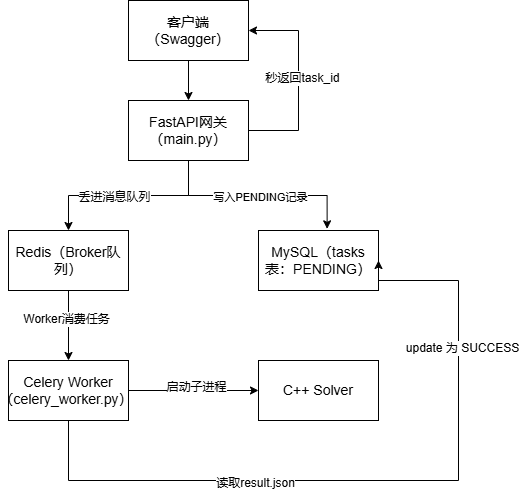

# CDP Solver - 组合优化求解器服务化封装

## 架构图

## 项目简介
本项目源于我的 CCF-C 论文《混合搜索算法求解 CDP》。为了将算法工程化落地，我将原 C++ 脚本重构为独立的计算引擎，并使用 Python FastAPI 封装成了具备数据库持久化能力的 RESTful API 服务。

## 技术架构
- **计算层**：C++ (混合搜索算法、增量式评估)
- **服务层**：Python, FastAPI, Uvicorn
- **调度层**：Python Subprocess (跨语言进程通信、超时中断)
- **存储层**：MySQL (PyMySQL，持久化实验结果)
- **测试**：Swagger UI, Python Requests

## 核心功能
1. **参数化调用**：通过 HTTP 接口传入实例路径、时间限制和随机种子。
2. **异步任务管理**：返回 task_id，支持按 ID 查询历史任务结果。
3. **超时中断与缓存清理**：防止 C++ 进程无限制占用资源，确保数据的幂等性。

## 如何运行
1. 编译 C++ 算法：`g++ -O2 "evolutionary.cpp" -o cdp_solver.exe -std=c++11`
2. 启动 FastAPI 服务：`cd backend && uvicorn main:app --reload`
3. 访问接口文档：`http://127.0.0.1:8000/docs`